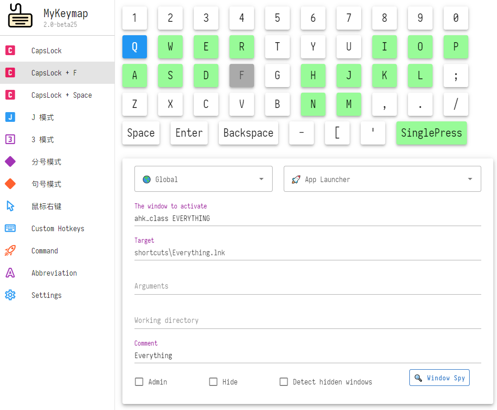

# MyKeymap

A program helps you improve the efficiency of using the keyboard.

## Features

- Quickly start and switch any application
- Control the mouse with the keyboard
- Remap keys: cursor control, digit input and symbol input on the home row

## Usage

- Enter `CapsLock`, `S`, `E` to open the settings window.

## Screenshots

## Differences from upstream

This fork is based on [xianyukang/MyKeymap](https://github.com/xianyukang/MyKeymap). Main differences:

- **Native settings window (Avalonia GUI)**: the old browser-based (Vue) settings page has been fully replaced by a native Avalonia desktop app (`config-ui-avalonia/`); the GUI launches `settings.exe --headless` as a child process and talks to the Go backend over localhost HTTP, config writing stays in the Go backend
- **Selected action system**: select text or files, then press a hotkey to trigger a preset action; rules are editable visually in the settings UI. Three match types — file extensions (with file-group quick fill, groups customizable via `fileGroups` in config.json), text features (URL / path / magnet link / plain text auto-detection), and any content; text features are strictly paired with dedicated actions (open URL, open path, open folder, magnet download, registry jump)
- **CommandInput skin**: the look of the command input box (background, border, gridlines, key colors, window position/width, shadow, hide animation, etc.) is configurable in the settings UI via the `commandInputSkin` field in config.json
- **"Matrix" digital rain**: running `bin\settings.exe` directly still shows the "Matrix" style digital rain in the console (disable via `options.hideMatrix`)
- **Tray recall**: bring back apps (e.g. WeChat/QQ) minimized to the tray instantly with a hotkey, without re-launching a new instance
- **Registry-based autostart + one-click uninstall script**; invalid hotkey configs are skipped with a tip instead of crashing the whole program
