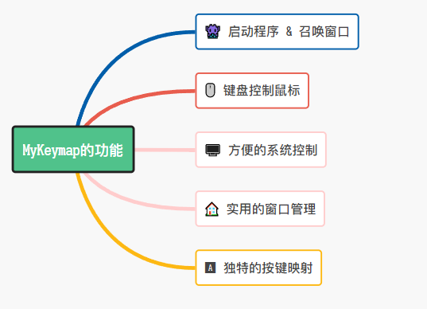
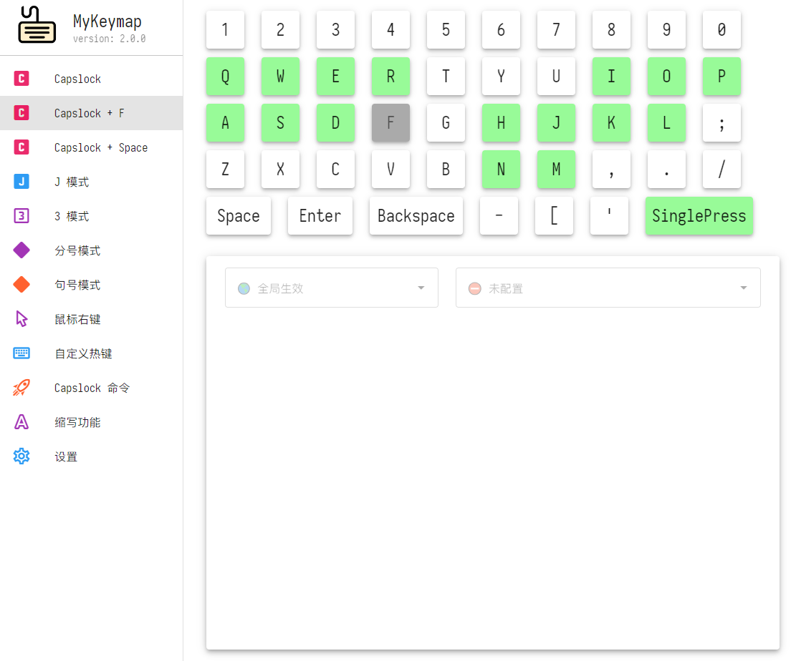

# MyKeymap

MyKeymap 是一款基于 [AutoHotkey](https://www.autohotkey.com/) 的键盘映射工具，用于增强 Windows 的键盘输入体验和窗口操作效率。

## Features

- **程序启动切换**: 用快捷键启动程序和切换窗口，对比搜索型的启动器，效率更高
- **键盘控制鼠标**: 用键盘控制鼠标，能减少键鼠切换，不必为了点一下而大幅移动手掌
- **按键重新映射**: 
  - 把常用按键重映射到主键区，能大大提升输入速度、编辑文字的效率
  - 内置了几套键位负责:「 光标控制 」、「 数字输入 」、「 符号输入 」

## Usage

- [快速入门](https://xianyukang.com/MyKeymap.html#mykeymap-%E7%AE%80%E4%BB%8B) & [视频介绍](https://www.bilibili.com/video/BV1Sf4y1c7p8)

|  |  |
| ------------------------------- | ----------------------------------- |

## Screenshots

## 与原版的差异

本 fork 基于上游 [xianyukang/MyKeymap](https://github.com/xianyukang/MyKeymap)，在原版基础上主要有这些不同：

- **更炫酷的设置窗口**：打开设置时显示「黑客帝国」风格的代码雨动画，并默认用 Windows Terminal（新版终端）承载，不再是老式黑窗口
- **新增「选中动作」系统**：选中文字或文件后按快捷键，即可执行预设操作（打开程序、搜索、运行命令、复制内容等）；规则可在设置界面可视化配置，无需改动任何代码
- **自定义帮助页**：在设置界面直接填写 HTML 帮助内容，保存后即可通过动作打开查看
- **更不容易崩溃**：某个热键配置出错时会自动跳过并提示，不会再导致整个程序退出；收集文本、关机动作等细节行为也更稳定
- **细节体验优化**：设置页菜单高亮跟随页面切换、快捷键输入框对齐、保存按钮始终可见
- **后台程序托盘一键唤出**：目标程序（如微信/QQ）最小化到托盘后，按快捷键可直接唤出主窗口（约 0.8 秒内，不会误触发「登录新账号」重复启动）
- **FlClash/资源管理器唤起修复**：FlClash 关闭后驻留状态栏时按快捷键秒开（直显隐藏窗口），可见时按快捷键可正常最小化/激活切换；资源管理器切换同步修复（v13）
- **托盘唤起后鼠标归位**：通过托盘图标唤出窗口后，鼠标自动还原到唤起前位置，不再停留在托盘图标上（v13）

> 🔧 开发者如需查看逐条详细修改记录（涉及的文件、修改原因、技术细节），请参阅 [与原版的差异（开发者版）](./doc/与原版的差异.md)。
